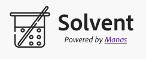

Welcome to <em>Solvent</em>. Solvent lets you use
*Solid*
apps in native context over your filesystem. You can create pod views
over your folders, configure root uri for them to be simulated, and
run apps over them.

Solvent uses [Manas](https://github.com/manomayam/manas) to abstract storage, and Tauri for abstracting UI.

> The project is a work in progress. Once it reached we;;-tested stability, a reusable crate will be extracted to nativify any Solid app with ease.
> 
